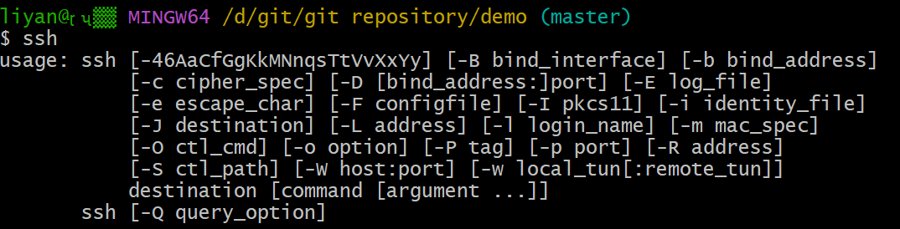

1. 查看仓库状态:

```
git status
```

2. 初始化git仓库:

```
git init
```

3. 添加文件hit.txt到git仓库

```
git add hit.txt
```

添加文件并不是提交到git仓库,他只是把文件添加到**[临时缓冲区]**,这个命令有效防止了错误提交的可能性

4. 提交文件hit.txt到git仓库

```
git commit -m "text commit"
```

5. 打印git仓库提交日志

```
git log
```

6. 查看git仓库的分支情况

```
git branch
```

7. 切换到a分支

```
git checkout a
```

8. 将分支a合并到master分支中

```
git merge a
```

9. 删除a分支

```
git branch -d a
或
git branch -D a(强制删除)
```

10. 为当前分支添加标签v1.0

```
git tag v1.0
git tag(查看标签记录)
```

# 接下来是通过git向GitHub提交代码

# 第一步:首先在GitHub上添加SSH key配置

想生成SSH key,先得安装SSH,对于Linux和 Mac 系统，其默认是安装 SSH 的，而对于 Windows 系统，其默认是不安装 SSH 的，不过由于我们安装了 Git Bash，其也应该自带了 SSH. 可以通过在 Git Bash 中输入ssh命令，查看本机是否安装 SSH：



如上图所示，此结果表示我们已经安装 SSH 啦！接下来，输入ssh-keygen -t rsa命令，表示我们指定 RSA 算法生成密钥，然后敲三次回车键，期间不需要输入密码，之后就会生成两个文件，分别为id_rsa和id_rsa.pub，即密钥id_rsa和公钥id_rsa.pub. 对于这两个文件，其都为隐藏文件，默认生成在以下目录：

Linux 系统：~/.ssh

Mac 系统：~/.ssh

Windows 系统：C:\Documents and Settings\username\\.ssh

Windows 10 ThinkPad：C:\Users\think\.ssh

密钥和公钥生成之后，我们要做的事情就是把公钥id_rsa.pub的内容添加到 GitHub，这样我们本地的密钥id_rsa和 GitHub 上的公钥id_rsa.pub才可以进行匹配，授权成功后，就可以向 GitHub 提交代码啦！
